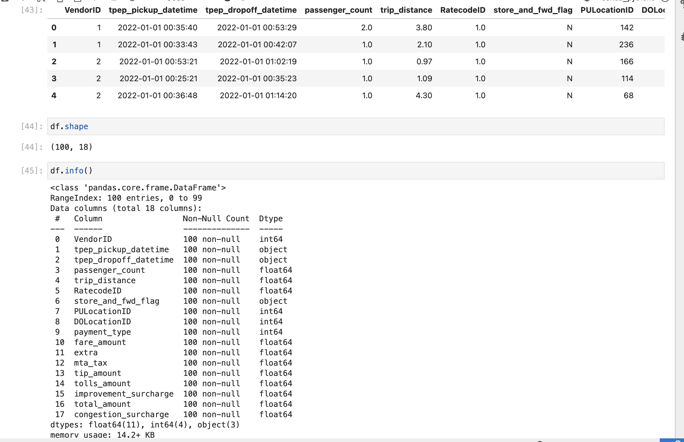
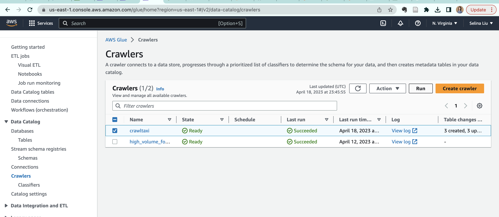

# Rust Big Data Platform Project
This is a project for IDS 721, and the goal of this project is to create a tool for data engineering that uses a big data platform. The Platforms used for this project are AWS S3, AWS Glue, AWS Athena, and AWS Sagemaker.

## Project Overview
The project analyzes and visualizes the NYC taxi trip dataset. The dataset is a popular open dataset of taxi trips in New York City. The dataset is available in 'Registry of Open Data on AWS' and was stored in a public S3 bucket. 

All analysis are done within an AWS Sagemaker notebook. I stored a copy of parts of the dataset in my own S3 bucket. The dataset is queried first using S3 Select. Later, when the data size exceed the limit of S3 select, I used AWS Glue - a fully managed extract, transform, and load (ETL) service to prepare and load data for analysis. I used Crawler inside AWS Glue to crawl data from S3 bucket, and then uses AWS Athena to query and store query results. The results of the queries are analyzed using pandas and visualized using matplotlib.

## Project Structure
The project is structured as follows:

## Project Steps Specifics
### Step 1: Create Self-owned S3 Bucket and examine self-owned buckets
- Import necessary libraries in the Sagemaker notebook
- Create S3 client for calling APIs
- Write function to create bucket and create one
- Write function to list buckets and list all buckets

### Step 2: Examine original (open data) S3 bucket, preview csv dataset
- Write function to list objects in the bucket
- List objects in open data S3 bucket with match word & size limit
- Preview public registry data

### Step 3: Copy among S3 buckets
- First check whether the key exists in the destination bucket, then copy

### Step 4: Query the dataset using S3 Select
- Write a function to query the dataset using S3 API

### Step 5: Create AWS Glue Database, use a Glue client to list databases
- Use AWS console to create an empty Glue database

- Use AWS Glue client to list databases

### Step 6: Crawl data to Glue Database using AWS Glue Crawler
- Use AWS console to create a crawler, note to point source to an S3 folder, not a file (otherwise Athena query will return 0 result)

- Run the crawler manually

### Step 7: Transform data using AWS Athena SQL-like queries, then list glue tables
- Use AWS Athena console to select the glue database just filled, then transform data using SQL-like syntax

- Use AWS Glue client to list tables in the database

### Step 8: Query the dataset using AWS Athena, save query results to S3 folder
- Use an athena client (in the notebook) and Athena API to query the dataset, save the output into a given bucket and folder

- After saving, display the result by reading in the saved csv and call df.head().

- Note: may need to make sure the s3_client (boto3) is using an aws access key, then use s3_client.get_object() to read the csv file
- *Note* DO NOT LEAVE THE AWS ACCESS KEY IN A PUBLIC REPO, IT IS NOT SECURE.

### Step 9: Analyze the dataset using pandas, visualize the dataset using matplotlib
- Examine the statistical correlations

- Visualize the correlations using a heatmap

## References

* [rust-cli-template](https://github.com/kbknapp/rust-cli-template)
* [Registry of Open Data on AWS - NYC trips](https://registry.opendata.aws/nyc-tlc-trip-records-pds/)
* [Cloud Experiments](https://github.com/aws-samples/cloud-experiments)